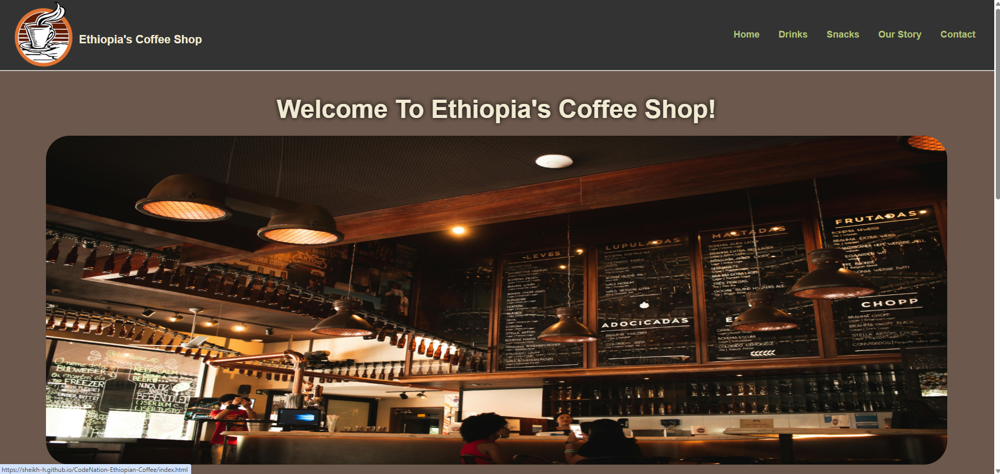

<h1 align="center">☕ Ethiopia's Coffee Shop</h1>

  <b>A visually engaging static website created using pure HTML and CSS, inspired by Ethiopia’s rich coffee culture.</b> 
  Built as part of my studies at <b>Code Nation</b>.

---

<h2>🌍 Project Overview</h2>

<b>Ethiopia's Coffee Shop</b> is a fully responsive, multi-page static website designed to highlight the vibrant coffee heritage of Ethiopia.
This project demonstrates strong skills in layout design, semantic HTML, CSS styling, and visual structure — without the use of JavaScript or frameworks.

---

<h2>🎨 Key Features</h2>

<ul>
  <li>🏠 <b>Homepage</b> featuring a welcoming introduction and “Best Sellers” section</li>
  <li>🥤 <b>Drinks & Snacks Pages</b> showcasing traditional Ethiopian coffee and foods</li>
  <li>📖 <b>Our Story Page</b> that shares the origins and cultural background of Ethiopian coffee</li>
  <li>📞 <b>Contact Page</b> for user inquiries</li>
  <li>🗺️ <b>Location Section</b> with address and map image</li>
  <li>⭐ <b>Customer Reviews</b> in a card layout</li>
  <li>🔗 <b>Responsive Navigation Bar</b> with hamburger menu for mobile screens</li>
  <li>💚 <b>Social Media Integration</b> using <code>Boxicons</code></li>
</ul>

---

<h2>🧩 Folder Structure</h2>

<pre>
EthiopiasCoffeeShop/
│
├── index.html              # Homepage
├── drinks.html             # Drinks page
├── snacks.html             # Snacks page
├── ourstory.html           # “Our Story” page
├── contactus.html          # Contact page
├── privacypolicy.html      # Privacy policy page
├── styles.css              # Stylesheet
├── Media/                  # Folder for images, icons, and favicon
│   ├── logo.png
│   ├── coffee_bar.jpg
│   ├── latte.jpeg
│   ├── ethiopian_snacks.jpg
│   ├── ethiopian_tea.jpg
│   ├── location.png
│   └── favicon.ico
└── README.md               # Project documentation
</pre>

---

<h2>🖥️ Live Demo</h2>

If you have deployed the site (e.g. via GitHub Pages or Netlify), include your link here: 
👉 <b><a href="#">https://yourusername.github.io/EthiopiasCoffeeShop/</a></b>

---

<h2>🚀 How to View Locally</h2>

<ol>
  <li>Download or clone this repository:</li>
  <pre>git clone https://github.com/YourUsername/EthiopiasCoffeeShop.git</pre>
  
  <li>Open the project folder:</li>
  <pre>cd EthiopiasCoffeeShop</pre>

  <li>Double-click <code>index.html</code> to open it in your browser.</li>
</ol>

---

<h2>🧠 Skills Demonstrated</h2>

<ul>
  <li>HTML5 semantics and page structure</li>
  <li>CSS3 styling, responsive layouts, and visual hierarchy</li>
  <li>Use of external icon libraries (<code>Boxicons</code>)</li>
  <li>Organized project folder management</li>
  <li>Accessibility and readability considerations</li>
</ul>

---

<h2>📸 Visual Preview</h2>

   
  <i>Homepage showcase — simple, elegant, and culturally themed.</i>

---

<h2>📜 License</h2>

This project is licensed under the <b>MIT License</b> — free to use, modify, and share.

<pre>
MIT License

Copyright (c) 2025 Sheikh

Permission is hereby granted, free of charge, to any person obtaining a copy
of this software and associated documentation files (the “Software”), to deal
in the Software without restriction...
</pre>

---

<h2>👨‍💻 Author</h2>

<b>Sheikh</b> 
💬 Learning to Code | Student Developer at Code Nation 
📧 Contact: <i>https://www.linkedin.com/in/sheikh-hussain/</i>

---

<h2 align="center">⭐ If you like this project, give it a star on GitHub!</h2>
